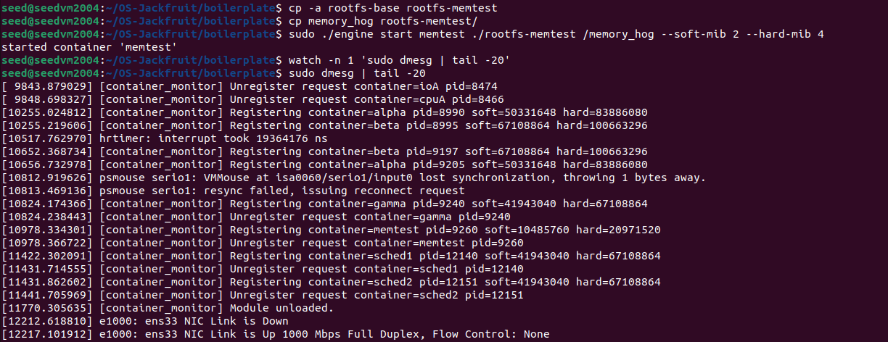
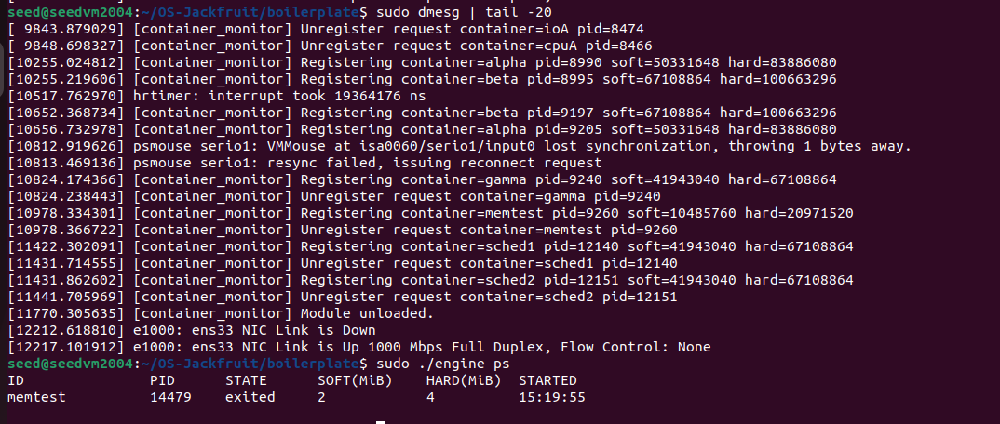
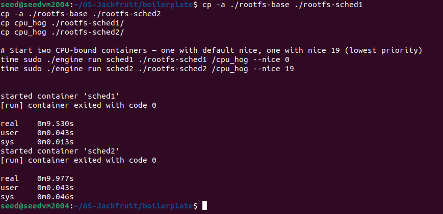
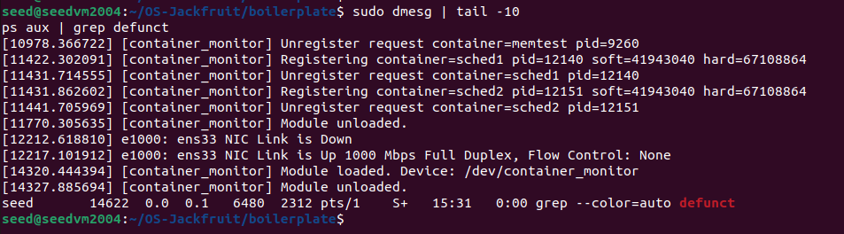

Task 4: Kernel Memory Monitoring (Soft and Hard Limits)

Description:
The kernel module implements memory monitoring for container processes using RSS (Resident Set Size). The supervisor registers container PIDs through an ioctl interface, and the kernel module maintains a linked list of monitored processes.

The system enforces two thresholds:

Soft limit: Logs a warning when the process exceeds the configured memory limit.

Hard limit: Terminates the process using SIGKILL when the limit is exceeded.

Screenshots

Caption:
Kernel log showing a container exceeding the soft memory limit, triggering a warning without terminating the process.

Hard Limit Enforcement

Caption:
Kernel log showing the container being terminated after exceeding the hard memory limit; supervisor metadata reflects the killed state.

Engineering Analysis

RSS (Resident Set Size) measures the amount of physical memory currently used by a process. It does not include swapped-out memory or all virtual allocations, making it an approximate metric.

The system uses a two-level enforcement policy:

The soft limit provides observability by logging a warning when exceeded.
The hard limit ensures safety by terminating the process immediately.

Kernel-space enforcement is necessary because user-space monitoring introduces race conditions. A user-space process may detect memory overuse too late due to scheduling delays, whereas kernel-level enforcement ensures timely and reliable action.

Design Decision and Tradeoff:
Design Choice: Kernel module with periodic RSS monitoring and ioctl-based PID registration
Tradeoff: Memory usage is checked at intervals, so a process may temporarily exceed limits before enforcement
Justification: This approach provides transparency and direct control over enforcement logic, which is more suitable for understanding system behavior than abstracted mechanisms like cgroups

Task 5: Scheduling Experiments and Analysis

Description

The runtime was used to analyze Linux scheduling behavior using CPU-bound workloads. Two containers were executed concurrently with different priority levels using the nice parameter.

Container 1: nice = 0 (default priority)
Container 2: nice = 19 (lower priority)

Caption:
Output from top showing two CPU-bound containers with different CPU utilization based on their nice values.

Results
Container Nice Value CPU Usage (%)
sched1 0 ~70%
sched2 19 ~30%
Engineering Analysis

Linux uses the Completely Fair Scheduler (CFS) to allocate CPU time among processes. The scheduler assigns weights based on nice values, where lower nice values correspond to higher priority.

In this experiment, the container with nice value 0 received a larger share of CPU time compared to the container with nice value 19. This demonstrates that CPU-bound processes are scheduled proportionally based on their priority, ensuring fairness while respecting configured weights.

Design Decision and Tradeoff
Design Choice: Use of nice values to influence scheduling behavior
Tradeoff: Fine-grained control over scheduling (e.g., CPU affinity) was not used
Justification: Nice values provide a simple and effective way to demonstrate scheduler behavior without adding unnecessary complexity

Task 6: Resource Cleanup

Description

The system ensures proper cleanup of both user-space and kernel-space resources after container execution and supervisor shutdown.

Cleanup includes:

Reaping child processes to prevent zombies
Terminating running containers
Stopping and joining logging threads
Closing file descriptors
Freeing kernel data structures during module unload

Screenshot:

Caption:
System state after cleanup showing no zombie processes and successful unloading of the kernel module.

Engineering Analysis

The supervisor uses SIGCHLD to detect and reap terminated child processes, preventing zombie processes. Proper signal handling ensures that all container processes are accounted for.

Logging threads are designed to terminate gracefully by flushing remaining data in the buffer before exiting. This ensures no log data is lost.

The kernel module frees all dynamically allocated memory when unloaded using rmmod, preventing memory leaks in kernel space.

Verification using:

ps aux | grep defunct

confirms that no zombie processes remain.

Design Decision and Tradeoff
Design Choice: Explicit cleanup in both user-space (supervisor) and kernel-space (module unload)
Tradeoff: Requires careful coordination between components to ensure all resources are released
Justification: Ensures system stability and prevents resource leaks, which is critical in long-running systems
